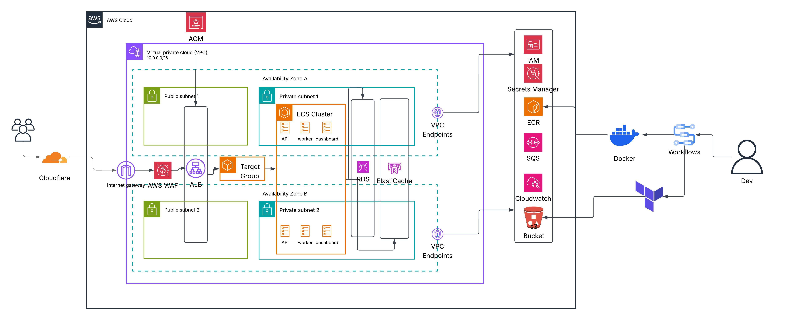
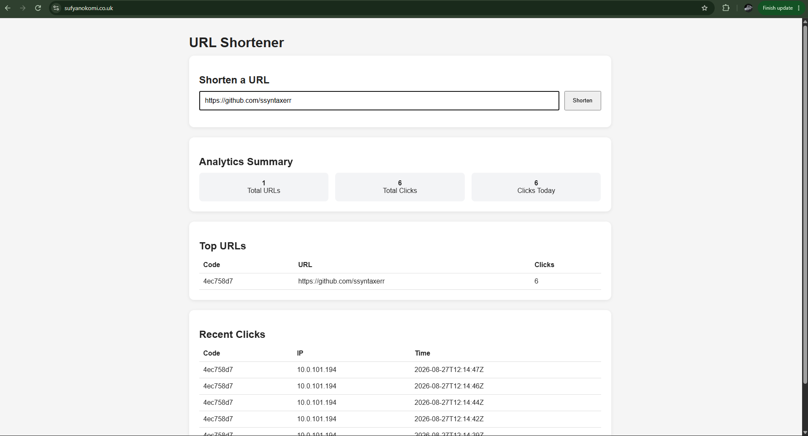
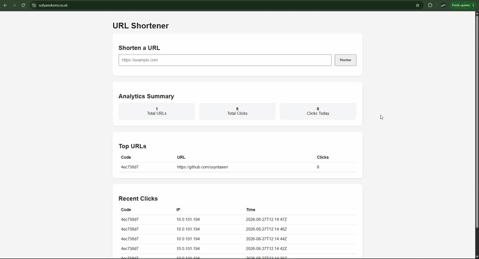

# URL-Shortener
**Overview:**
A production-style, containerised URL shortener deployed on **AWS** using **Amazon ECS Fargate**, with infrastructure provisioned using **Terraform** and deployments automated through **GitHub Actions**.

The project was built to demonstrate how a multi-service application can move from local development to a secure, highly available AWS architecture using Infrastructure as Code, CI/CD, private networking, asynchronous processing, caching, observability and cost-conscious cloud design.

---

## Architecture 📐



### High-Level Architecture 📐

```text
User
 │
 ▼
Cloudflare
 │
 ▼
AWS
 │
 ├── AWS WAF
 │
 ▼
Application Load Balancer
 │
 ├── API Service
 │
 └── Dashboard Service
 │
 ▼
ECS Fargate
 │
 ├── API
 ├── Dashboard
 └── Worker
 │
 ├── Amazon RDS PostgreSQL
 ├── Amazon ElastiCache for Redis
 └── Amazon SQS

Developer
 │
 ▼
GitHub
 │
 ▼
GitHub Actions
 │
 ├── Docker Build
 ├── Security Scanning
 ├── Amazon ECR
 └── Terraform
       │
       ▼
      AWS
```
---

## Previews 👀





---

## Technology Stack 🏗️

### Application 🖥️
- Python / FastAPI – URL shortener API.
- Go – dashboard and background worker services.
- PostgreSQL – persistent relational data.
- Redis – caching layer.
- Docker – containerisation of application services.

### AWS ☁️
- Amazon ECS
- AWS Fargate
- Amazon ECR
- Application Load Balancer
- Amazon RDS for PostgreSQL
- Amazon ElastiCache for Redis
- Amazon SQS
- Amazon CloudWatch
- AWS WAF
- AWS Certificate Manager
- AWS Secrets Manager
- Amazon S3
- AWS IAM
- VPC Endpoints
- Internet Gateway

### Infrastructure & CI/CD 🏢
- Terraform
- GitHub
- GitHub Actions
- GitHub OIDC
- Docker
- Cloudflare

---

## Process ⚙️

### Provision Infrastructure with Terraform 🌍

**Create VPC** 


Create:
- VPC
- Two Availability Zones
- Two public subnets
- Two private subnets
- Internet Gateway
- Public route table
- Private route tables
- Route table associations

**Create Security Groups**


Create security groups for:
- Application Load Balancer
- ECS workloads
- RDS
- Redis
- VPC endpoints
Restrict communication to only the required ports and source security groups.

**Create VPC Endpoints**


Create the required endpoints so workloads in private subnets can access AWS services without a NAT Gateway.
These include:
- ECR API
- ECR Docker
- Secrets Manager
- SQS
- CloudWatch logs
- S3
Interface endpoint security groups allow HTTPS from the ECS workloads where required.

**Create ECR Repositories**


Create repositories for the application images:
- API
- Dashboard
- Worker

Build the Docker Images
```
docker build -t url-shortener-api ./api
```
Repeat for each service.

**Authenticate Docker to ECR**
```
aws ecr get-login-password \
  --region eu-west-2 \
| docker login \
  --username AWS \
  --password-stdin <account-id>.dkr.ecr.eu-west-2.amazonaws.com
```

**Tag and Push Images**
```
docker tag \
  url-shortener-api:latest \
  <account-id>.dkr.ecr.eu-west-2.amazonaws.com/url-shortener-api:<tag>

docker push \
  <account-id>.dkr.ecr.eu-west-2.amazonaws.com/url-shortener-api:<tag>
```
Repeat for the dashboard and worker images.

**Create RDS**


Create:
- RDS DB subnet group
- PostgreSQL RDS instance
- RDS security group
- Database credentials
- Required parameter/configuration settings

PostgreSQL for:
- Relational data fit
- Analytics style access
- Flexible queries
Database remains private.

**Create ElastiCache**


Create:
- ElastiCache subnet group
- Redis cache/replication group
- Redis security group
Redis also remains private.

**Create SQS**


Create the queue used by the API and worker.
Configure:
- Visibility timeout
- Message retention
- Dead-letter queue
- Redrive policy

**Store Secrets**


Create secrets in AWS Secrets Manager:
- Database credentials
Grant the ECS roles access only to the secrets they require.

**Create IAM Roles**


Create:
- ECS task execution role
- ECS application task role(s)
- GitHub Actions deployment role
- Required IAM policies
Follow least privilege wherever possible.

**Create CloudWatch Resources**


Create the required log groups for each service:
- API logs
- Dashboard logs
- Worker logs
Configure the ECS task definitions to use the awslogs log driver.

**Create ECS Cluster**
- Create ECS Task Definitions for:
  - API
  - Dashboard
  - Worker

- Configure:
  - CPU
  - Memory
  - Container image
  - Environment variables
  - Secrets
  - IAM roles
  - Logging
  - Health checks
  - Ports
 
**Create the Application Load Balancer**
- Create an internet-facing ALB across both public subnets
- Attach the ALB security group

**Create Target Groups**
- Create the required target groups for public-facing ECS services
- Target Type: IP
- Configure application health checks for each target group

**Configure ACM**
- Request an ACM certificate for the application domain
- Validate ownership using DNS
- Attach the validated certificate to the ALB HTTPS listener

**Configure ALB Listeners**


Create:
```
HTTP :80
   ↓
Redirect
   ↓
HTTPS :443
```
The HTTPS listener forwards traffic to the appropriate target group.

**Create AWS WAF**
- Create the Web ACL and required rules
- Associate the Web ACL with the ALB

**Create ECS Services**


Create ECS services for:
- API
- Dashboard
- Worker
The API and dashboard services integrate with the appropriate ALB target groups.
The worker runs privately and does not require an internet-facing listener.

**Configure Cloudflare**


Create the DNS record that points the application's domain toward the AWS load balancer.
Once DNS and ACM are configured correctly, the application can be reached using HTTPS.

**Configure GitHub OIDC**


Create an IAM OIDC trust relationship allowing the GitHub repository to assume the deployment role.
This avoids storing permanent AWS credentials inside GitHub.

### CI/CD ♾️

GitHub Actions automates application delivery.

The general workflow is:
```
Developer
   ↓
git push
   ↓
GitHub
   ↓
GitHub Actions
   │
   ├── Test
   ├── Build
   ├── Security Scan
   ├── Authenticate to AWS with OIDC
   ├── Push Images to ECR
   └── Deploy to ECS
```
**App Deploy Pipeline**
- Builds Docker images
- Performs security scanning
- Authenticates to AWS using OIDC
- Logs Docker into ECR
- Tags images using the Git commit SHA
- Pushes the images to ECR
Immutable SHA-based image tags makes it possible to identify exactly which commit produced a running container.

**Infrastructure Pipeline**


Terraform executed through Github Actions:
```
terraform fmt
      ↓
terraform init
      ↓
terraform validate
      ↓
terraform plan
      ↓
terraform apply
```
This moves infrastructure changes through a repeatable deployment process rather than relying on manual console changes.

**Destroying the Environment**


The main environment can be removed using:
```
terraform destroy
```

---

## Security Decisions 🔐

Several security controls are built into the architecture:
- ECS workloads run in private subnets
- RDS is not publicly accessible
- Redis is not publicly accessible
- Security groups reference other security groups rather than exposing internal services publicly
- HTTPS is enforced using ACM
- AWS WAF protects the public application endpoint
- Secrets are stored outside source code
- IAM roles follow least-privilege principles
- GitHub authenticates to AWS using OIDC instead of permanent access keys
- Private workloads use VPC endpoints for supported AWS services
- Container images are scanned before deployment
- Application containers run using non-root users where possible

---

## FinOps / Cost Optimisation 💰

**No NAT Gateway**
Private ECS workloads instead use VPC endpoints to communicate with required AWS services. 
This removes NAT Gateway hourly and processing charges while retaining private networking

**Fargate**
Fargate avoids paying for permanently provisioned EC2 worker nodes.
Compute is allocated to the ECS tasks that actually run.

**Right-Sized Tasks**
CPU and memory are configured based on the requirements of each service rather than allocating identical oversized resources to every workload.

**Asynchronous Processing**
SQS allows background workloads to be separated from the API.
This means API compute does not need to be over-provisioned simply to accommodate background processing.

**S3 Remote State**
S3 provides inexpensive durable storage for Terraform state.

---

## Database Choice 📊

I chose **Amazon RDS for PostgreSQL** as the primary database because the application stores structured, relational data such as shortened URLs, click events and associated metadata.

PostgreSQL was a better fit than DynamoDB for this project because it provides:

- **Relational data modelling** using tables, foreign keys and constraints
- **Flexible querying** for dashboard and analytics use cases
- **Strong consistency and transactions** for maintaining data integrity
- **Indexes and SQL aggregations** for querying click data efficiently

DynamoDB would have been well suited to a simpler key-value workload such as:

`short_code → destination_url`

However, the application also required more complex querying and relationships between stored data. Using DynamoDB would have required designing the table around specific access patterns in advance and would have made analytics-style queries less straightforward.

For these reasons, **PostgreSQL provided the best balance of data integrity, query flexibility and maintainability for the application's requirements**.

## Future Improvements ⏩

**Possible future improvements include:**
- ECS Service Auto Scaling.
- SQS queue-depth-based worker scaling.
- Additional CloudWatch alarms and dashboards.
- Dead-letter queue monitoring.
- Automated database backups and restore testing.
- Blue/green deployments.
- Load testing.
- Chaos/failure testing.
- Additional WAF rules.
- Automated dependency updates.
- More comprehensive integration testing.
- AWS Budgets and cost alerts.
- Terraform policy/security scanning in CI.
- Deployment environments for development, staging and production.
